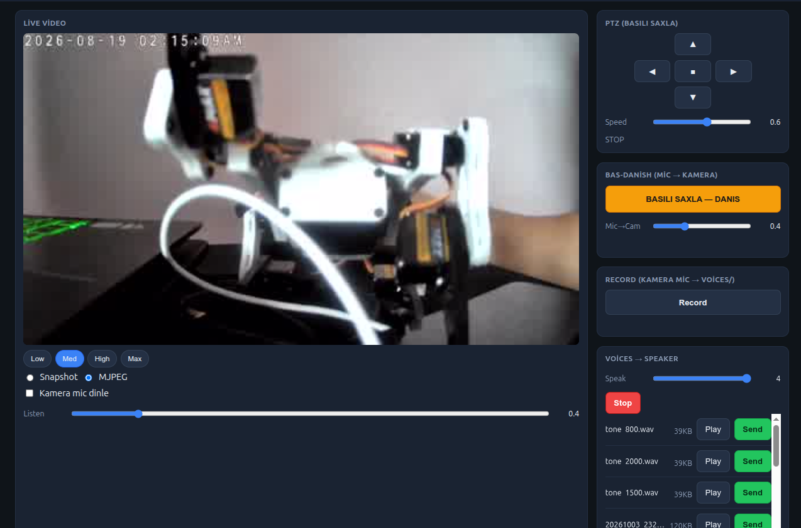

# Tapo C211 Web Panel

<p align="center">
  
</p>

Local web control panel for **TP-Link Tapo C211** (and similar pan/tilt models) **without go2rtc**.

Features:

- Live video (MJPEG / snapshot poll)
- Listen to camera microphone in the browser
- Push-to-talk (browser mic → camera speaker)
- Play recorded / uploaded WAV files to the camera speaker
- Record camera mic to `voices/`
- PTZ via ONVIF ContinuousMove (hold to move, release to stop)
- Mobile-friendly UI (touch PTT, large controls)

Everything talks to the camera **directly** (RTSP, ONVIF port 2020, proprietary talk on port 8800).

---

## Requirements

- Python 3.10+ (tested on 3.12)
- `ffmpeg` in `PATH`
- Network access to the camera

Python packages:

```bash
pip install flask pytapo onvif-zeep
```

Optional but recommended for push-to-talk in a remote browser:

- HTTPS (self-signed cert is enough on a LAN)

```bash
openssl req -x509 -newkey rsa:2048 -nodes \
  -keyout key.pem -out cert.pem -days 365 \
  -subj "/CN=tapo-panel"
```

Browsers only allow microphone access on **HTTPS** or **localhost**.

---

## Quick start

1. Edit `CFG` in `web_server.py` (IP, passwords, voices path).
2. Put voice files in the `voices/` directory (created automatically when recording).
3. Run:

```bash
cd tapo_web
python web_server.py
```

- HTTP:  `http://0.0.0.0:8083`
- HTTPS: `https://0.0.0.0:8083` if `cert.pem` / `key.pem` are next to `web_server.py`

Open the panel from a phone or PC on the same network.

---

## Configuration (`web_server.py`)

```python
CFG = {
    "camera_ip": "192.168.1.117",
    "camera_user": "admin1",          # Camera Account (Tapo app)
    "camera_pass": "YOUR_CAMERA_PASS", # RTSP + ONVIF
    "onvif_pass": "YOUR_CAMERA_PASS",  # can match camera_pass
    "cloud_pass": "YOUR_CLOUD_PASS",   # Tapo account password (talk / speaker)
    "voices_dir": "/path/to/voices",
    "volume": 2.5,                     # file → speaker default gain
    "onvif_port": 2020,
    "ptz_speed": 0.6,
    "http_port": 8083,
    "video_stream": "2",               # 1=main, 2=sub
    "video_width": 480,
    "video_q": 12,
    "video_fps": 10,
    "rtsp_transport": "udp",           # or "tcp"
}
```

### Passwords

| Use | Credential |
|-----|------------|
| RTSP video / mic | Camera Account user + password |
| ONVIF PTZ | Same Camera Account (ONVIF port **2020**) |
| Speaker (talk) | Tapo **cloud** password → SHA-256 uppercase for Digest auth on port **8800** |

Create the Camera Account in the Tapo app: **Device → Advanced → Camera Account**.

---

## Module layout

```
tapo_web/
├── web_server.py         # Flask app, UI, registers all blueprints
├── web_live_video.py     # RTSP → JPEG snapshot / MJPEG
├── web_receive_voice.py  # RTSP audio → browser (PCM s16le 8 kHz)
├── web_speak.py          # Speaker: files, PTT, Digest talk protocol
├── web_record.py         # Record camera mic → voices/*.wav
├── web_ptz.py            # ONVIF ContinuousMove + Stop
├── cert.pem / key.pem    # optional TLS
└── README.md
```

| Module | Role |
|--------|------|
| **web_server.py** | Entry point, HTML UI, config, blueprint wiring |
| **web_live_video.py** | Live picture from RTSP via ffmpeg |
| **web_receive_voice.py** | Stream camera mic to the browser |
| **web_speak.py** | Send audio to camera speaker (file or live mic) |
| **web_record.py** | Toggle record of camera mic into `voices/` |
| **web_ptz.py** | Pan/tilt using ONVIF |

---

## Features in detail

### Live video

- **MJPEG** (default): continuous multipart JPEG from ffmpeg.
- **Snapshot**: background ffmpeg keeps only the **latest** frame; the UI polls `/api/snapshot` (~10 fps). Often smoother / lower lag than raw MJPEG when the network is slow.

Quality presets in the UI:

| Preset | Stream | Width | JPEG q | FPS |
|--------|--------|-------|--------|-----|
| Low | 2 | 320 | 14 | 8 |
| Med | 2 | 480 | 12 | 10 |
| High | 2 | 720 | 8 | 12 |
| Max | 1 | 1280 | 5 | 15 |

ffmpeg uses `nobuffer` / `low_delay` and prefers **UDP** RTSP (falls back to TCP in the snapshot worker).

### Listen (camera → PC)

- `GET /api/camera_audio` streams raw **PCM s16le mono 8 kHz**.
- Browser plays it with Web Audio API.
- **Listen** slider adjusts local gain (0–3).

### Speak (PC → camera speaker)

Two paths:

1. **Voices list** — `Send` converts a file with ffmpeg to **PCMA 8 kHz** and pushes it over the Tapo talk protocol (port **8800**). **Stop** aborts mid-play.
2. **Push-to-talk** — hold the button; browser mic is resampled to 8 kHz, sent as PCM, converted to A-law on the server, then streamed as MPEG-TS (`audio/mp2t`) in the same talk session.

Talk protocol (from working go2rtc / pcap analysis):

1. `POST /stream` → `401` + Digest challenge  
2. Digest: user `admin`, password = **SHA-256(cloud_password).upper()**  
3. JSON: `{"params":{"talk":{"mode":"aec"},"method":"get"},...}`  
4. Multipart parts: `Content-Type: audio/mp2t`, `X-Session-Id`, stream type **0x90** (PCMA)

**Play** in the voices list plays the file **locally** in the browser (`GET /api/voices/<file>`).  
**Send** plays it on the **camera speaker**.

### Record

Toggle **Record**: ffmpeg captures RTSP audio to `voices/YYYYMMDD_HHMMSS.wav` (8 kHz mono WAV). Toggle again to stop. Files appear in the list for Play / Send.

### PTZ

ONVIF **ContinuousMove** / **Stop** (not step-based motor API):

- Hold a direction (UI or WASD / arrow keys) → move  
- Release → stop  
- **Speed** slider 0.1–1.0  

Requires working ONVIF on port 2020 with the Camera Account.

---

## HTTP API (summary)

| Method | Path | Description |
|--------|------|-------------|
| GET | `/` | Web UI |
| GET | `/api/mjpeg` | MJPEG stream (`stream`, `w`, `q`, `fps`, `t`) |
| GET | `/api/snapshot` | Latest JPEG frame (same query params) |
| GET | `/api/camera_audio` | PCM mic stream |
| GET | `/api/voices` | List files + speak status |
| GET | `/api/voices/<name>` | Download / play file |
| POST | `/api/speak` | `{"file":"x.wav"}` → speaker |
| POST | `/api/speak_stop` | Stop file playback |
| POST | `/api/ptt/start` | Open talk session |
| POST | `/api/ptt/audio` | Body: raw s16le PCM @ 8 kHz |
| POST | `/api/ptt/stop` | Close talk session |
| POST | `/api/record/toggle` | Start/stop recording |
| GET | `/api/record/status` | Recording state |
| POST | `/api/ptz` | `{"action":"start","dir":"left","speed":0.6}` or `{"action":"stop"}` |
| GET/POST | `/api/settings` | `volume`, `ptt_gain` |

---

## UI controls

- **Quality chips** — Low / Med / High / Max  
- **Snapshot / MJPEG** — video mode  
- **Listen** + volume slider  
- **PTZ pad** + speed slider + keyboard  
- **Hold to talk** + Mic→Cam gain  
- **Record** toggle  
- **Voices** — Play (PC), Send (camera), Stop, Speak volume  

Sliders persist in `localStorage`. Speak / PTT gains are also pushed to `/api/settings`.

---

## Security notes

- Do **not** expose this panel to the public Internet without authentication and real TLS.
- Default bind is `0.0.0.0` (all interfaces) for LAN use.
- Credentials are stored in plain text in `CFG` — use env vars or a private config file if you publish the repo.
- Self-signed HTTPS is only for LAN mic access; browsers will show a certificate warning.

---

## Troubleshooting

| Symptom | What to try |
|---------|-------------|
| No video | Check RTSP: `ffplay -rtsp_transport tcp "rtsp://user:pass@IP:554/stream2"`; try `rtsp_transport: "tcp"` |
| Choppy video | Use **Snapshot** mode, **Low/Med** quality, or reduce FPS |
| PTZ no move | Verify ONVIF port 2020 and Camera Account password; test with a small ONVIF ContinuousMove script |
| Speaker silent / 401 on talk | Confirm **cloud** password; firmware should support local talk; only one talk client at a time |
| PTT mic blocked | Use HTTPS or open `http://127.0.0.1:8083` via SSH tunnel |
| Listen `InvalidAccessError` | Fixed by recreating AudioContext on each enable; hard-refresh if an old tab is open |
| Record empty file | Ensure RTSP has an audio track; stop cleanly with the toggle |

---

## Related standalone tools

Outside this panel you may already have:

- CLI talk script (PCMA → port 8800)  
- ONVIF PTZ keyboard client (ContinuousMove + key timeout)  
- `pytapo` `moveMotor` for step moves (not used by the panel’s real-time PTZ)

The panel prefers **ONVIF ContinuousMove** for hold-to-move behavior.

---

## License

Use and modify for your own deployments. TP-Link / Tapo are trademarks of their owners. This project is unofficial and not affiliated with TP-Link.
